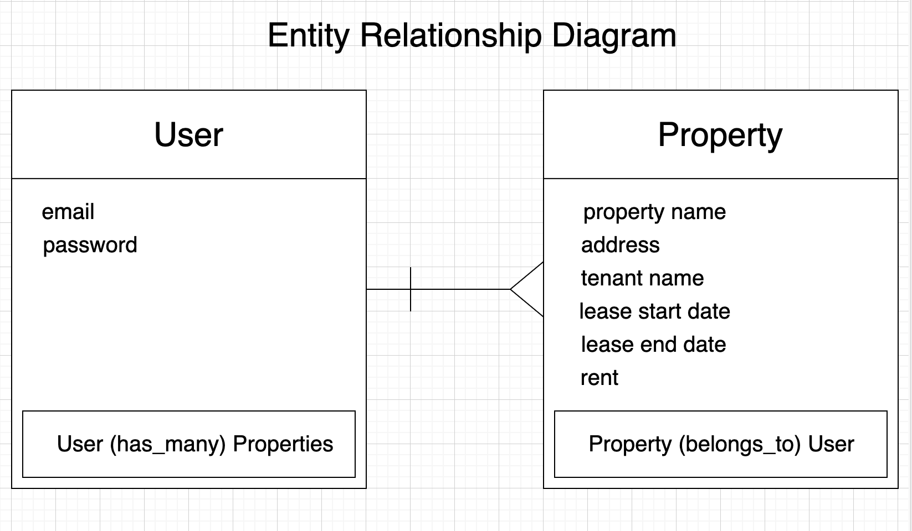

## propert-manager (backend)
### Repository link: https://github.com/khalsaniwas/property-manager-backend
### Production site link: https://property-manager-hs.herokuapp.com/properties
### Development site link: http://localhost:4741/

Property Manager is a back end application programming interface. 

## property-manager (frontend)
### Repository link: https://github.com/khalsaniwas/property-manager
### Production site link: https://khalsaniwas.github.io/property-manager/
### Development site link: http://localhost:7165/

## Technologies used

Github
Git
Ruby
Ruby on rails
visual studio code
Terminal
web browser
dev tool
PostgreSQL
psql
heroku
curl scripts
Postman
Heroku

## Entity relationship diagram

## Planning
I started thinking of what resource I want to create to be able to connect it to user. I draw an entity relationship diagram for user who has email and password and second resource is Property (home or rental property). I added Name, Address, Tenant name, lease start, end date and rent for Property resource. A user has_many properties and Property belong_to user.
 

## Development story
I user rails for my back end application Api, I started with creating Property resource with scaffold command in rails. Added relation ship for both user and property table. Connect the backend to Heroku database by deploying to Heroku. I tested backend routes by writing scripts in postman to signup, signin and the create a resource. Then connected backend application to front end. I used four Api routes for signup, signin, change password and signout. Then started working on testing routes for resource property to get property list, single property, create properties, update properties and to delete properties, Each request for property require a token to make sure only authorized signed in user which is the woner of that property is able to delete or update them. users cannot acces the data of other users.

## Unsolved problems
I want to set an alert system as my stretch goal based on lease start and end date to notify the prperty owner in advance.

## Api routes

### Authentication Endpoints
`https://property-manager-hs.herokuapp.com/`         
| Verb   | URI Pattern            | Controller#Action |
|--------|------------------------|-------------------|
| POST   | `/sign-up`             | `users#signup`    |
| POST   | `/sign-in`             | `users#signin`    |
| PATCH  | `/change-password`     | `users#changepw`  |
| DELETE | `/sign-out`            | `users#signout`   |

### Properties Endpoints

| Verb   | URI Pattern            | Controller#Action |
|--------|------------------------|-------------------|
| GET    | `/properties`          | `properties#index`|
| GET    | `/properties/:id`      | `properties#show` |
| PATCH  | `/properties/:id`      | `properties#update`|
| DELETE | `/properties/:id`      | `properties#destroy`|
| POST   |  `/properties`         | `properties#create`|

## Set up and installation instructions

### For local work environment
- Open Terminal or command line
- Create .env file for settings (`touch .env`)
- Generate new `development` and `test` secrets (`bundle exec rails secret`).
- Store them in `.env` with keys `SECRET_KEY_BASE_<DEVELOPMENT|TEST>`
    respectively.
- In order to make requests to your deployed API, you will need to set
    `SECRET_KEY_BASE` in the environment of the production API (for example, using `heroku config:set` or the Heroku dashboard).
- In order to make requests from your deployed client application, you will
    need to set `CLIENT_ORIGIN` in the environment of the production API (for example, `heroku config:set CLIENT_ORIGIN=https://<github-username>.github.io`).
- See more about deploying to heroku [rails-heroku-setup-guide](https://git.generalassemb.ly/ga-wdi-boston/rails-heroku-setup-guide)

### Setup your database:
    - bin/rails db:drop (if it already exists)
    - bin/rails db:create
    - bin/rails db:migrate
    - bin/rails db:seed
    - bin/rails db:examples

### Run your server!
- Run the API server with `bin/rails server` or `bundle exec rails server`.

